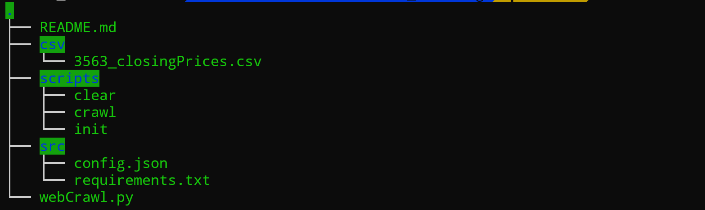

# Stock Crawling

[](https://github.com/yourusername/stock-crawling/releases)
[](LICENSE)

> A python script for crawling daily stock price information on TWSE & TPEX

## Website Release Notes
Latest version: v1.0.0 (2024-03-XX)
- Initial release with TWSE & TPEX stock data crawling
- Supports daily closing price crawling
- See [Release History](#release-history) for detailed changes
- Link: https://stock-crawling.vercel.app/

證券交易所(TWSE)：
https://www.twse.com.tw/zh/trading/historical/stock-day-avg.html
https://www.twse.com.tw/zh/trading/historical/bwibbu.html

櫃買中心(TPEX)：
https://www.tpex.org.tw/web/stock/aftertrading/daily_trading_info/st43.php?l=zh-tw
https://www.tpex.org.tw/web/stock/aftertrading/peratio_stk/pera.php?l=zh-tw

## Original Structure


csv: 儲存爬網結果

scripts: 執行指令

src:

- config.json: 修改爬網資料
  
  **website 需輸入 twse/tpex**
- requirements.txt: 爬網所需 python module

## Command (皆須在 stock_crawling 此層執行)

1. 刪除所有 csv 內之檔案
   ```
   ./scripts/clear
   ```
2. 安裝執行所需套件
   ```
   ./scripts/init
   ```
3. 爬取收盤價 & 計算波動度資料
   ```
   ./scripts/crawl_closing
   ```
4. 爬取本益比 & 股價淨值比
   ./scripts/crawl_ratio
5. 合併兩資料集 (避免爬取過多資料被網頁阻擋)
   ```
   ./scripts/concat
   ```
   修改欲合併之檔案可於 concat.py 內修改
   
